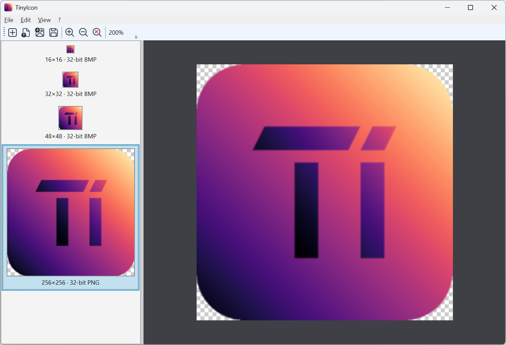

# TinyIcon

[](https://github.com/pzychotic/TinyIcon/blob/main/LICENSE)
[](https://github.com/pzychotic/TinyIcon/releases/latest)
[](https://github.com/pzychotic/TinyIcon/actions/workflows/ci.yml)

A tiny windows icon file (.ico) creator.

Define your wanted resolutions, import image, save. Done!



See the [Changelog](Docs/Changelog.md) for release notes.

## Features

- Multi-resolution icons: pick the sub-images your `.ico` should contain from 8×8 up to 256×256
- Color depth: 1, 4, 8, 16, 24 and 32-bit entries, selectable independently per resolution
- Open an existing `.ico` and edit it further: every entry is read back, including palettized and PNG-compressed ones
- Add sub-images to an icon (Edit menu, right-click the left panel, or Ins): new entries are scaled from the largest existing one
- Delete sub-images (Edit menu, right-click a preview, or Del)
- Import a source image (`.png`, `.bmp`, `.jpg`, `.gif`, `.tiff`) that gets downscaled into every sub-image
- Drop a file on the window: an `.ico` is opened, any other image is imported
- Non-square sources are fitted and centred with transparent padding, so the aspect ratio is kept
- Full alpha transparency for 32-bit entries; all lower depths use a 1-bit mask
- Automatic encoding per sub-image: PNG for 256×256 32-bit entries, classic DIB/BMP for the rest
- Detail view with zoom (Ctrl +/-/\*, or mouse wheel), pan (right mouse drag, right click recentres)
- Keyboard shortcuts for the whole workflow (see [Keyboard Shortcuts](#keyboard-shortcuts))
- Remembers your window placement and the last resolution selection per color depth between runs

## User Guide

1. **Create or open an icon:** *File ▸ New Icon…* lets you pick the resolutions for each color depth. *File ▸ Open Icon…* loads an existing `.ico` instead.
2. **Import an image:** *File ▸ Import Image…* scales your source image into every sub-image. You can also drop a file on the window.
3. **Check the result:** select a preview in the left panel to see it in the detail view on the right. Zoom with the mouse wheel and pan by dragging with the right mouse button.
4. **Adjust the sub-images:** add or delete entries from the *Edit* menu, the right-click menu in the left panel, or the keyboard.
5. **Save:** *File ▸ Save Icon…* writes the `.ico`.

### Keyboard Shortcuts

| Shortcut | Action |
| --- | --- |
| <kbd>Ctrl</kbd>+<kbd>N</kbd> | Create a new icon and choose its sub-images |
| <kbd>Ctrl</kbd>+<kbd>O</kbd> | Open an existing `.ico` file |
| <kbd>Ctrl</kbd>+<kbd>I</kbd> | Import a source image into all sub-images |
| <kbd>Ctrl</kbd>+<kbd>S</kbd> | Save the icon |
| <kbd>Ins</kbd> | Add sub-images to the current icon |
| <kbd>Del</kbd> | Delete the selected sub-image |
| <kbd>Ctrl</kbd>+<kbd>+</kbd> | Zoom in on the detail view |
| <kbd>Ctrl</kbd>+<kbd>-</kbd> | Zoom out of the detail view |
| <kbd>Ctrl</kbd>+<kbd>*</kbd> | Reset the zoom to 100% |

## Build
### From the command line

Prerequisites:
- .NET SDK 10.0 - install from https://dotnet.microsoft.com/

Build and run:
1. Build:
   ```
   dotnet build
   ```
2. Test (optional):
   ```
   dotnet test
   ```
3. Run:
   ```
   dotnet run --project Source\TinyIcon\TinyIcon.csproj
   ```

### From Visual Studio 2026

Prerequisites:
- .Net Desktop development workload
- .Net 10.0 Runtime
- .Net SDK

Just open ```TinyIcon.slnx``` build and run.

## Dependencies

- [CommunityToolkit.Mvvm](https://github.com/CommunityToolkit/dotnet)
- [Microsoft.Xaml.Behaviors.Wpf](https://github.com/microsoft/XamlBehaviorsWpf)

## References

- Icons created from [Fluent System Icons](https://github.com/microsoft/fluentui-system-icons)
